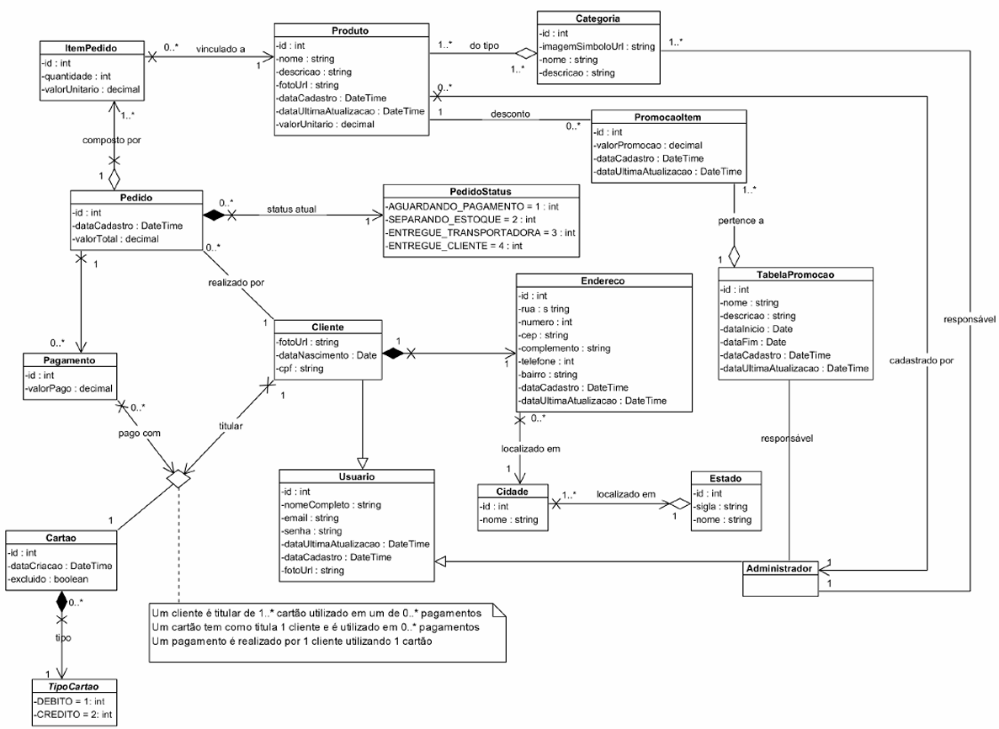

# 🛒 VassCommerce API

[](https://www.oracle.com/java/)
[](https://spring.io/projects/spring-boot)
[](https://maven.apache.org/)

O **VassCommerce** é um serviço web que simula um pequeno sistema de e-commerce.  
Ele foi desenvolvido como **exercício de estudo em Java**, baseado em um **diagrama de classes fornecido**.  

A API contempla funcionalidades típicas de plataformas de comércio eletrônico, como **cadastro de clientes, gerenciamento de produtos, pedidos, pagamentos e promoções**.

---

## 📌 Funcionalidades Principais

###  Cadastro de Clientes
- Registro de informações pessoais (CPF, data de nascimento, foto, etc.)
- Associação de **endereços** e **cartões de pagamento**

###  Gerenciamento de Produtos
- Produtos vinculados a **categorias**
- Cada categoria possui um **administrador responsável**
- Apenas o administrador da categoria pode cadastrar novos produtos

###  Pedidos
- Criação de pedidos contendo **múltiplos itens**
- Cálculo automático do **valor total**
- Controle de **status do pedido**:
  - Aguardando pagamento  
  - Separando estoque  
  - Entregue à transportadora  
  - Entregue ao cliente  

###  Pagamentos
- Um pedido pode ser pago com **vários cartões**
- Cada cartão pertence a um cliente e pode ser do tipo **crédito ou débito**
- Possibilidade de **dividir o pagamento entre diferentes cartões**

###  Promoções
- Administração de **tabelas de promoções**
- Cada promoção tem período de validade (**data início e fim**)
- Produtos podem participar de várias promoções  
- O **menor preço sempre é considerado**
- Qualquer administrador pode cadastrar novas promoções

---

## 📊 Diagrama de Classes

O sistema foi modelado a partir do seguinte diagrama de classes de análise:



O diagrama representa os relacionamentos entre **clientes, usuários, pedidos, produtos, categorias, promoções e administradores**.

---

## 🏗️ Estrutura da API

### 📌 Entidades Principais
- **Cliente**
- **Usuário**
- **Administrador**
- **Produto**
- **Categoria**
- **Pedido**
- **ItemPedido**
- **Pagamento**
- **Cartão / TipoCartão**
- **TabelaPromoção / PromoçãoItem**
- **Endereço / Cidade / Estado**

---

## ⚙️ Tecnologias Utilizadas

- **Java 21+**
- **Spring Boot 3.x**
- **Maven**
- **JUnit** (testes)
- **PostgreSQL** (banco de dados)
- **PgAdmin** (opcional, para visualização e gerenciamento das tabelas)
- **Postman** (para testar endpoints)
- **Docker** (container)

---

## 🚀 Como Executar o Projeto

### 1. Clone o repositório
```bash
git clone https://github.com/devjuliomartins/VassCommerce-Univass-LabFullStack.git
